# Seta core for MiSTer

MiSTer FPGA cores for [Seta](https://en.wikipedia.org/wiki/Seta_Corporation)'s X1-010 arcade
hardware, built with Quartus Prime 17.0.2 Lite for the DE10-nano:

* **Seta** — MAME's `seta/seta.cpp`
* **Seta_Downtown** — MAME's `seta/downtown.cpp`: + 65C02 sub CPU

## Contents

- [History](#history)
- [Games](#games)
  - [Game Notes](#game-notes)
  - [Supported](#supported)
  - [Out of scope for now](#out-of-scope-for-now)
- [Hardware](#hardware)
  - [Video timing](#video-timing)
- [Screenshots](#screenshots)
- [Installation](#installation)
- [Status](#status)
  - [Todo](#todo)
  - [Resource usage](#resource-usage)
- [AI Attestation](#ai-attestation)
- [Verification](#verification)
- [Acknowledgements](#acknowledgements)
- [Layout](#layout)
- [License](#license)

## History

* **Arcade-SetaDowntown_20260921.rbf**
  * Thundercade: Revert the attempt to fix the sprite flickering. It turns out that it's correct precisely as it was (it draws the sprites to RAM every other frame/30Hz whilst rendering at 60Hz, leading to rendering mid-write [PCB recording](https://www.youtube.com/watch?v=g4TswNhGXjM))

* **Arcade-Seta_20260919.rbf / Arcade-SetaDowntown_20260919.rbf**
  * Seta_Downtown: Added Thundercade / Twin Formation
  * Note: Thundercade sprites still flicker in some scenes. The sprite snapshot is tied to the game's control register writes, so sprites update every other frame (removed in 20260921)
  * Rotary joysticks for DownTown with the Ikari Warriors core's controls: Rotate Left / Rotate Right buttons, Rotary Speed, GRS Super Joystick (keystroke mode). The options only show for DownTown
  * Downtown core: Use an impulse for reliable coin entry
  * Twin Eagle: the carrier no longer flickers
  * Gundhara and Oishii Puzzle: add a fake Flip Screen DIP

* **Arcade-Seta_20260918.rbf / Arcade-SetaDowntown_20260918.rbf**
  * Seta_Downtown core added: DownTown / Mokugeki (four sets), Twin Eagle, Arbalester, Meta Fox
  * 68000 is now fx68k, cycle-accurate; TG68K ran 3.5x too fast, and was causing issues
  * CRT width: Match 384 option removed
  * Sprites: games that flip their own sprite page (26 of 31, `scripts/sprctrl_scan.py`) have it copied at the flip. Fixes Strike Gunner's ship and asteroids, Mad Shark, and Gundhara's full-screen glitch under slowdown
  * Sprites: the vblank copy runs in each board's order, as MAME's; Quiz Kokology's bees and Blandia's intro illustration are right
  * Tile VRAM writes queued to vblank: Gundhara's occasional wrong tiles. A CPU read waits for the queue, so Blandia passes its VRAM test and boots
  * DownTown ran too fast: the vblank interrupt was raised on both edges
  * Audio mix OSD option (Mono, None, 25%, 50%), defaulting to mono
  * DIPs with three or more bits (most coinage settings) showed only half their settings ([#6](https://github.com/ppriest/Arcade-Seta_MiSTer/issues/6))
  * Blandia, Dragon Unit: coinage labels that depend on Coinage Type show both, e.g. `Coin B (Mode 1|2)` = `5C/1C|3C/7C`
  * Button 3 wired for Blandia, as MAME's JOY_TYPE1_3BUTTONS; J. J. Squawkers shows two buttons (MAME declares three, the game reads two)
  * Wit's players 3 and 4 wired
  * `scripts/check_dips.py` and `scripts/check_inputs.py` check every `.mra`'s DIPs and every set's inputs against MAME

* **`Arcade-Seta_20260913.rbf`**
  * Fast ROM loading
  * Timer interrupt ran at half rate: music at the right speed in War of Aero and the other five timer games
  * Flip screen DIP now works for all games that have one, as a true 180 degree rotation (MAME is 128 px / 8 lines out, see `docs/MAME_DIVERGENCE.md`)
  * Oishii Puzzle tile layers no longer flipped with the sprites
  * Mobile Suit Gundam interrupts fixed
  * Extreme Downhill boot screen black
  * Tile row cache for busy 6bpp lines
  * CRT adjust: H-Size, H-Position, V-Shift
  * CRT width: Match 384 for the 320-wide games

* **`Arcade-Seta_20260912.rbf`**
  * Blandia and Zombie Raid added
  * Sound in Extreme Downhill and Sokonuke Taisen
  * J. J. Squawkers passes its boot RAM test

* **`Arcade-Seta_20260911.rbf`**
  * All twenty sets run
  * Tilemap tearing fixed
  * Inputs/DIPs all reviewed and corrected (6 button Daioh)

* **`Arcade-Seta_20260910.rbf`**
  * **Alpha release**
  * Support for a bunch of games in varying states of running

## Games

The goal is to support the collection of hardware covered by MAME in `seta.cpp` and `downtown.cpp`. Minus bootlegs on different hardware, and betting hardware.

### Game Notes

* **DownTown** - The "GRS Super Joystick" option is for players using the GRS Super Joystick, set to its keystroke mode. 

  * When it's on: Keyboard keys turn the stick. The Left and Right arrow keys rotate Player 1's stick, and C and V rotate Player 2's. In keystroke mode the GRS sends its spinner movement as exactly those key presses. When the setting is off, the core ignores these keys.
  * The rotation runs at the fastest rate. A held key steps the stick every 39 ms, the same as "Very Fast". It overrides the Rotary Speed setting, for the Rotate Left/Right buttons as well.

  * The Rotate Left and Rotate Right buttons work either way. The layout copies the Ikari Warriors core's option of the same name.

* **Daioh** - You can flip between the USA 6 button and the Japanese 2 button arrangement from the DIP menu

* **Zombie Raid** - There is options to help with simulating a lightgun
  * P1 stick / P2 stick (Auto / Aim / D-pad) — 'Auto' reads a fully deflected axis as a direction and a partial one as a position. 'D-pad' for when using e.g. an arcade stick simulating an analogue left-stick. 'Aim' is absolute behaviour for a real analog stick.
  * Crosshair - (P1 / P2 / P1+P2) - Self-explanatory. Matches the location the game knows the cursor to be. Red is P1, Blue is P2. It's hack.
  * Mouse aims (P1 / P2 / Off) — a mouse moves that player's aim, with left button as Trigger and right as Reload. Relative, so it inherits the game's own calibration.
  * The gun calibration is kept in battery RAM, which is saved to the `.nvm` file when the OSD is next opened (or from `Save settings`).
  * Reportedly it _does_ work on a Guncon 2, but it's not great with the dark scenes and jumps around

* **CRT adjust** (all games) - H-Size, H-Position and V-Shift for an analog CRT, from rmonic79's [Arcade-Raiden_MiSTer](https://github.com/rmonic79/Arcade-Raiden_MiSTer).

### Supported

Seta_Downtown games are a separate core, `SetaDowntown_*.rbf`. All are ROT270 with a W65C02 sub CPU; sound is the X1-010 on the 68000, except Thundercade (YM2203 + YM3812 on the 65C02).

| Name | Year | Manufacturer | Core | Main CPU | Tilemaps | Notes |
|-|-|-|-|-|-|-|
| Thundercade / Twin Formation | 1987 | Seta (Taito license) | Seta_Downtown | M68000 @ 8 MHz + W65C02 @ 2 MHz | 0 | YM2203 + YM3812 |
| Twin Eagle - Revenge Joe's Brother | 1988 | Seta (Taito license) | Seta_Downtown | M68000 @ 8 MHz + W65C02 @ 2 MHz | 1× 4bpp | Protection |
| Wit's | 1989 | Athena (Visco license) | Seta | M68000 @ 8 MHz | 0 | Four players |
| Dragon Unit / Castle of Dragon | 1989 | Athena / Seta | Seta | M68000 @ 8 MHz | 1× 4bpp | |
| DownTown / Mokugeki | 1989 | Seta | Seta_Downtown | M68000 @ 8 MHz + W65C02 @ 2 MHz | 1× 4bpp | Rotary joysticks, Protection |
| Arbalester | 1989 | Jordan I.S. / Seta | Seta_Downtown | M68000 @ 8 MHz + W65C02 @ 2 MHz | 1× 4bpp | |
| Meta Fox | 1989 | Jordan I.S. / Seta | Seta_Downtown | M68000 @ 8 MHz + W65C02 @ 2 MHz | 1× 4bpp | Protection |
| Thunder & Lightning | 1990 | Seta | Seta | M68000 @ 8 MHz | 0 | Has protection |
| Pairs Love | 1991 | Athena / Nihon System | Seta | M68000 @ 8 MHz | 0 | 2048 palette entries |
| Strike Gunner S.T.G | 1991 | Athena / Tecmo | Seta | M68000 @ 8 MHz | 1× 4bpp | |
| Rezon | 1991 | Allumer | Seta | M68000 @ 16 MHz | 2× 4bpp | |
| Block Carnival / Thunder & Lightning 2 | 1992 | Visco | Seta | M68000 @ 8 MHz | 0 | |
| Ultraman Club | 1992 | Banpresto | Seta | M68000 @ 16 MHz | 0 | |
| SD Gundam Neo Battling | 1992 | Banpresto | Seta | M68000 @ 16 MHz | 0 | |
| Quiz Kokology | 1992 | Tecmo | Seta | M68000 @ 8 MHz | 1× 4bpp | |
| Quiz Kokology 2 | 1992 | Tecmo | Seta | M68000 @ 8 MHz | 1× 4bpp | |
| Zing Zing Zip | 1992 | Allumer / Tecmo | Seta | M68000 @ 16 MHz | 6bpp + 4bpp | vblank IRQ is level 3 |
| Blandia | 1992 | Allumer | Seta | M68000 @ 16 MHz | 2× 6bpp | Second palette bank and its offset effect; banked samples |
| Athena no Hatena? | 1993 | Athena | Seta | M68000 @ 16 MHz | 0 | 2 MB of sprites, 64 KB of work RAM mirrored |
| Daioh | 1993 | Athena | Seta | M68000 @ 16 MHz | 2× 4bpp | |
| Mobile Suit Gundam | 1993 | Banpresto | Seta | M68000 @ 16 MHz | 2× 4bpp | 4 MB of sprites |
| War of Aero | 1993 | Yang Cheng | Seta | M68000 @ 16 MHz | 2× 4bpp | uPD71054C timer |
| Oishii Puzzle Ha Irimasenka | 1993 | Sunsoft / Atlus | Seta | M68000 @ 16 MHz | 2× 4bpp | |
| Kamen Rider Club Battle Race | 1993 | Banpresto | Seta | M68000 @ 16 MHz | 2× 4bpp | Timer |
| J. J. Squawkers | 1993 | Athena / Able | Seta | M68000 @ 16 MHz | 2× 6bpp | |
| Mad Shark | 1993 | Allumer | Seta | M68000 @ 16 MHz | 2× 6bpp | |
| Eight Forces | 1994 | Tecmo | Seta | M68000 @ 16 MHz | 2× 4bpp | 12 MB of ROM |
| Magical Speed | 1994 | Allumer | Seta | M68000 @ 16 MHz | 2× 4bpp | Timer; as Kamen Rider |
| Extreme Downhill | 1995 | Sammy | Seta | M68000 @ 16 MHz | 6bpp + 4bpp | 320 wide; a 4 MB tile region |
| Sokonuke Taisen Game | 1995 | Sammy | Seta | M68000 @ 16 MHz | 6bpp + 4bpp | |
| Gundhara | 1995 | Banpresto | Seta | M68000 @ 16 MHz | 2× 6bpp | 8 MB of sprites and 17 MB of ROM, a second work-RAM block |
| Zombie Raid | 1995 | American Sammy | Seta | M68000 @ 16 MHz | 2× 6bpp | ADC0834 light gun, battery-backed RAM, 4 MB of samples |

### Out of scope for now

| MAME description | Why |
|-|-|
| Thunder & Lightning (bootleg with Tetris sound, set 1) | Z80 + YM2151 |
| Thunder & Lightning (bootleg with Tetris sound, set 2) | Z80 + YM2151 |
| Wiggie Waggie | Z80 + OKI M6295 |
| Super Bar | Z80 + OKI M6295 |
| Block Carnival / Thunder & Lightning 2 (bootleg) | Z80 + OKI M6295 + YM2151 |
| Zing Zing Zip (bootleg) | OKI M6295; video registers rearranged |
| Mad Shark (bootleg) | OKI M6295 |
| Triple Fun | OKI M6295 |
| Sum-eoitneun Deongdalireul Chat-ara! | OKI M6295 |
| J. J. Squawkers (bootleg) | X1-010, own memory map |
| J. J. Squawkers (bootleg, Blandia Conversion) | X1-010, own memory map |
| Simpson Junior (bootleg of J. J. Squawkers) | X1-010, own memory map |
| Mobile Suit Gundam (bootleg) | X1-010, own memory map |
| Jockey Club (v1.18) | Betting hardware: ACIA6850 serial, hoppers |
| International Toote (Germany, P523.V01) | Betting hardware |
| International Toote II (v1.24, P387.V01) | Betting hardware |
| Sport of Kings (France, P436.08) | Betting hardware |
| Gran Derby (Spanish hack of Jockey Club) | Betting hardware |
| Ultra Toukon Densetsu (Japan) | X1-010 + Z80 and YM3438 |
| Crazy Fight | YM3812 + OKI M6295 |
| Daioh (prototype, earliest) | missing program ROMs |
| U.S. Classic (`downtown.cpp`) | Not yet: two trackballs through a uPD4701, colour PROMs, 6bpp tiles |

## Hardware

| Chip | Function | Status |
|-|-|-|
| X1-001A + X1-002A | Sprites, and the "floating tilemap" made of sprite columns | Written, verified against MAME |
| X1-006 | Palette, `xRRRRRGGGGGBBBBB` | Written |
| X1-007 | Video blanking | Written |
| X1-010 | 16-voice PCM / wavetable sound | Written, verified against MAME |
| X1-004 | Input handling | Folded into the address decode |
| X1-005 / X1-009 | NVRAM | Zombie Raid's battery RAM, saved to the `.nvm` file |
| X1-011 | Graphics mixing | Written |
| X1-012 | Tilemaps | Written, verified against MAME |
| uPD71054C | Programmable interval timer (8254) | Written, channel 0 (the IRQ 4 timer) |
| ADC0834 | Zombie Raid's light gun ADC | Written |

### Video timing

Every game runs an 8 MHz dot clock (16 MHz / 2), 512 dots per line and 272 lines per frame:

* 8,000,000 / 512 = **15,625 Hz** line rate
* 15,625 / 272 = **57.4449 Hz** frame rate

MAME gives only refresh rates. The one marked "verified on PCB" in `seta.cpp` is Daioh's 57.42 Hz; the 60 Hz sets carry no comment.

Confirmed on a PCB: Guru's measurement of Caliber 50 (`downtown.cpp`, same X1-001 / X1-007 / X1-012 chipset) is **HSync 15.6250 kHz, VSync 57.4449 Hz** on X1-007 pins 22 and 23, the calculated values exactly.

Not every board measures the same:

| Board | HSync | VSync | Source |
|-|-|-|-|
| Caliber 50 | 15.6250 kHz | 57.4449 Hz | `downtown.cpp`, Guru |
| SD Gundam Neo Battling (in this core) | 15.22 kHz | 58 Hz | `seta.cpp`, Guru |
| Crazy Fight (out of scope) | 15.1433 kHz | 59.1851 Hz | `seta.cpp`, Guru |
| Thundercade (Seta_Downtown core) | 15.21 kHz | 59.1845 Hz | `downtown.cpp`, Guru |

Some links discussing the hardware:
* https://www.arcade-museum.com/manuf/Seta.html

## Screenshots

### Thundercade / Twin Formation

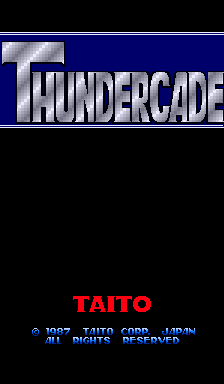
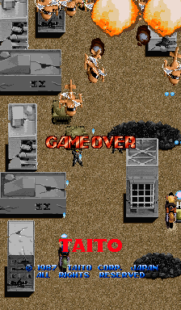
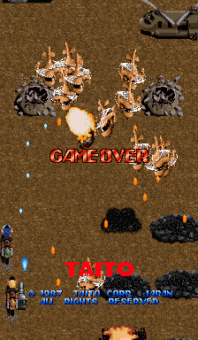

### Twin Eagle - Revenge Joe's Brother

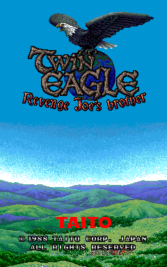
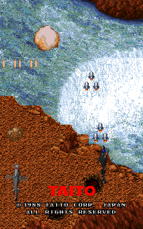

### Wit's

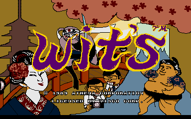
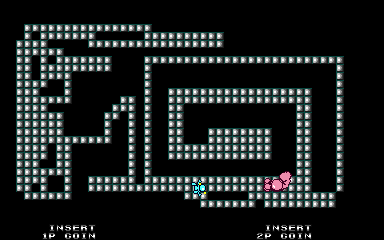

### Dragon Unit / Castle of Dragon

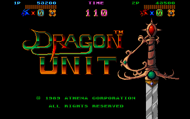
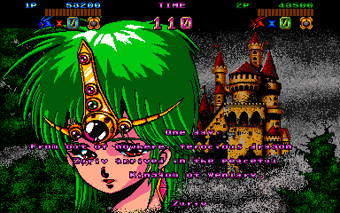
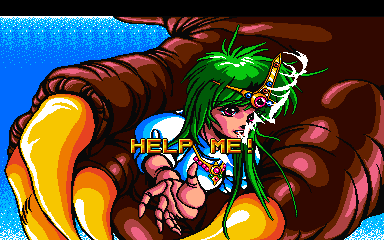
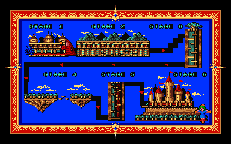
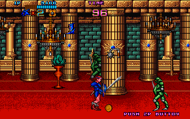

### DownTown / Mokugeki

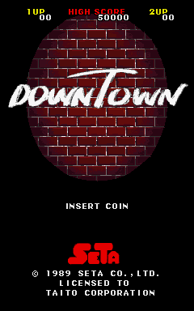
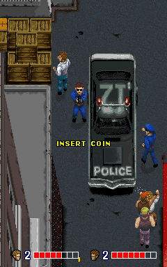
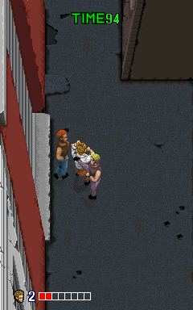

### Arbalester

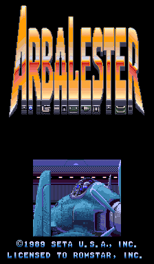
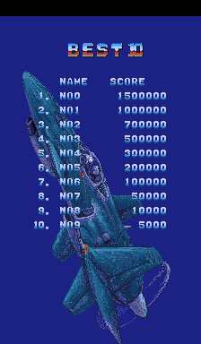
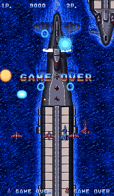

### Meta Fox

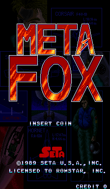
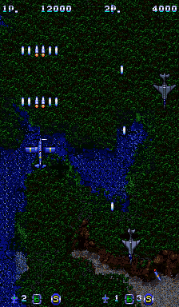
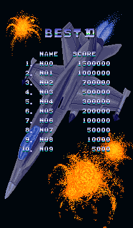
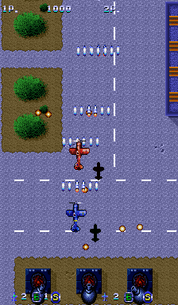

### Thunder & Lightning

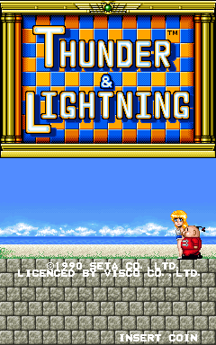
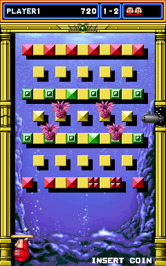

### Pairs Love

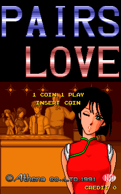
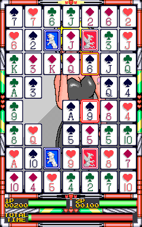

### Strike Gunner S.T.G

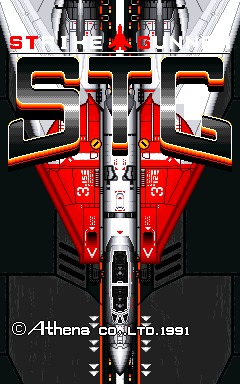
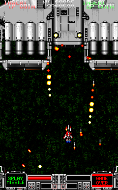
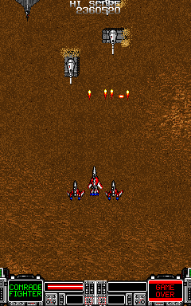

### Rezon

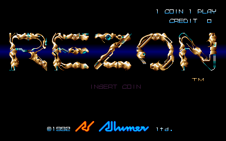
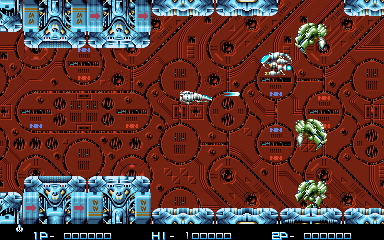
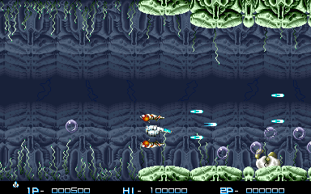

### Block Carnival / Thunder & Lightning 2

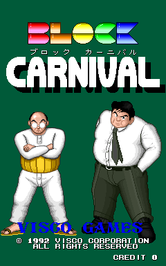
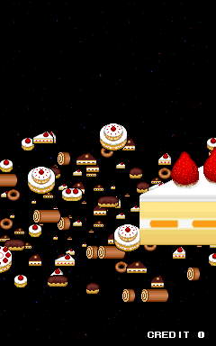
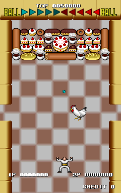

### Ultraman Club

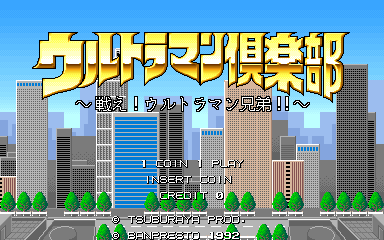
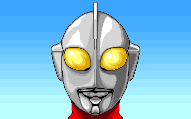
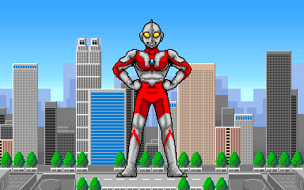
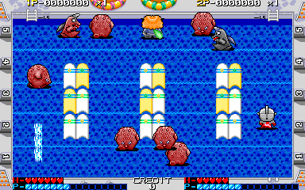

### SD Gundam Neo Battling

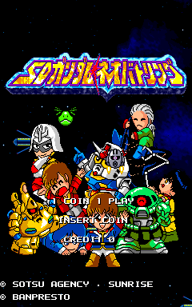
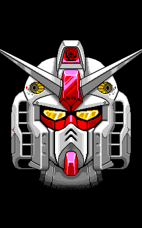
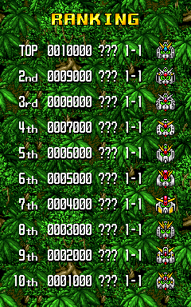
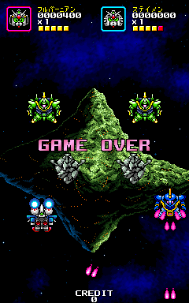

### Quiz Kokology

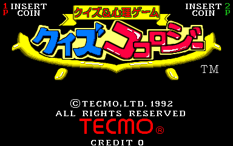
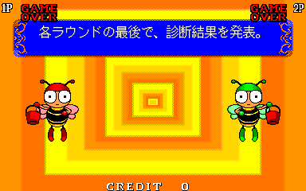

### Quiz Kokology 2

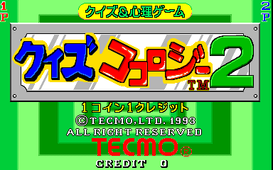
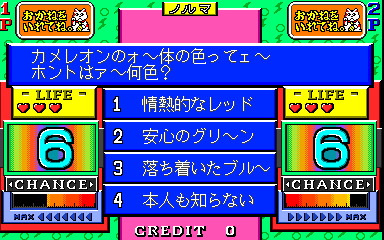

### Zing Zing Zip

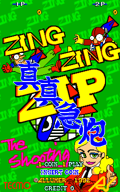
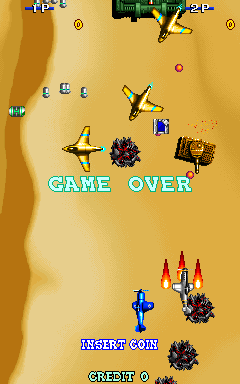

### Blandia

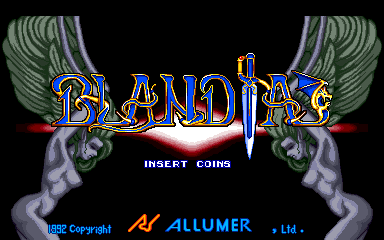

### Athena no Hatena?

### Daioh

### Mobile Suit Gundam

### War of Aero

### Oishii Puzzle Ha Irimasenka

### Kamen Rider Club Battle Race

### J. J. Squawkers

### Mad Shark

### Eight Forces

### Magical Speed

### Extreme Downhill

### Sokonuke Taisen Game

### Gundhara

### Zombie Raid

## Installation

* Take the latest `*.rbf` from `releases/` and put it in `_Arcade/cores`, renamed to drop the `Arcade-` prefix: `Arcade-Seta_20260913.rbf` becomes `Seta_20260913.rbf`. The `.mra` files' `<rbf>Seta</rbf>` matches either name, but MiSTer launches the highest-sorting match, and any `Seta_*.rbf` sorts above every `Arcade-Seta_*.rbf`, so a prefixed copy left alongside is never used
* Seta_Downtown: the same, with its `.rbf` renamed from `Arcade-SetaDowntown_*.rbf` to `SetaDowntown_*.rbf`
* Take the `*.mra` files from `releases/` and subdirs and put them in `_Arcade`
* Put the MAME merged or split ROMs in `games/mame`

## Status

Known issues:
* **Thunder & Lightning** - Character sprites in attract glitch in at the edge of the screen. The same in MAME. Appears to be an original game bug.
* **Thundercade** - Sprites flicker in attract. The game's vblank handler copies half of its sprite list to sprite RAM each frame and the list is rebuilt between the two copies, so sprite RAM holds two versions of it. MAME shows the same, and so does a [PCB recording](https://www.youtube.com/watch?v=g4TswNhGXjM), so the core draws every frame as it comes (`docs/MAME_DIVERGENCE.md`).
* **Twin Eagle** - The guns on the carrier deck run a frame behind the tilemap when it moves side to side. Want to confirm on a real PCB.

See `docs/MAME_DIVERGENCE.md` for cases that are considered 'hacks' from MAME, and also any cases where we diverge from MAME.

### Todo

- [x] 68000 pace: TG68K ran a `nop; dbra` loop 3.5x faster than a 68000 (`sim/tg68k_pace_tb`), and Twin Eagle's boot reached its error handler. Replaced by fx68k (`sim/fx68k_pace_tb`); Twin Eagle boots
- [ ] `hiscore.v` support, savestates
- [ ] `zombraidp` / `zombraidpj` `.mra` files -- ERASE00 regions loaded in three byte lanes
- [ ] `daiohc` — the `wrofaero` machine config with `daioh`-sized graphics, needs its own arm
- [ ] The three 14.318181 MHz games (`orbs`, `keroppi`, `krzybowl`) need a Bresenham clock enable
- [ ] Upstream to MAME: flip screen as the unflipped frame rotated 180 -- the x1_012 tilemap mirror about the 512x256 bitmap, and the per-game flip offsets (`fg_yoffs`, `fg_xoffs`, layer `xoffs`) in `docs/MAME_DIVERGENCE.md`

### Resource usage

Whole core (`Arcade-Seta_20260913.rbf`), on the DE10-nano's Cyclone V 5CSEBA6, speed grade 7:

| resource | used | available |
| --- | --- | --- |
| Logic (ALMs) | 26,348 (63%) | 41,910 |
| Block memory bits | 4,261,313 (75%) | 5,662,720 |
| RAM blocks | 542 (98%) | 553 |
| DSP blocks | 44 (39%) | 112 |
| PLLs | 3 | 6 |

## AI Attestation

This core is being developed with heavy use of a frontier coding assistant. The author is somewhat familiar with some of the games on this platform, being a co-author of the MAME driver.

## Verification

Not PCB-validated. MAME is the accuracy reference for the most part, with its own acknowledged uncertainties noted where they matter. Goal is to reconcile the inconsistencies and unlikely behaviour. The exception so far is flip screen, checked against the unflipped picture rotated 180 degrees rather than against MAME.

* Hardware facts come from the MAME driver and verified against it.
  * Graphics layouts were decoded from real ROM data before any RTL used them
  * The CPU is diffed against a real MAME trace
  * The sprite engine and the video path are diffed against MAME's own render
  * The sound is diffed against a line-by-line transcription of MAME's mixer.
  * The ROM_START records, the DIP switches to generate the `.mra` titles

* VBlank, Sprite and tilemap buffering behaviour (and divergent Blandia behaviour) validated by exhaustively checking and reconciling behaviours. See `docs\MAME_DIVERGENCE.md` and `docs\write_timing_mame.txt`

## Acknowledgements

- **Sorgelig** and the **MiSTer-devel team** for
  - the [Template_MiSTer](https://github.com/MiSTer-devel/Template_MiSTer) framework this project
    is seeded from
  - the SDRAM controller (`sdram.sv`, vendored via
    [Arcade-Jackal_MiSTer](https://github.com/MiSTer-devel/Arcade-Jackal_MiSTer), with burst-4
    reads added)
  - the screen-rotation module (`screen_rotate_two.sv`, from
    [Arcade-SKNS_MiSTer](https://github.com/MiSTer-devel/Arcade-SKNS_MiSTer))
- The **MAMEdev team** — in particular **Luca Elia** and **David Haywood** — for
  [MAME](https://github.com/mamedev/mame)'s `seta/seta.cpp`, `video/x1_001.cpp` and
  `sound/x1_010.cpp`. There is no FPGA implementation of the X1-010 anywhere, so MAME's C++ is the
  whole specification for the sound chip.
- **Tobias Gubener** ([TobiFlex](https://github.com/TobiFlex)) for
  [TG68K.C](https://github.com/TobiFlex/TG68K.C).
- **Umberto Parisi** ([rmonic79](https://github.com/rmonic79)) for `crt_adjust.sv`, from
  [Arcade-Raiden_MiSTer](https://github.com/rmonic79/Arcade-Raiden_MiSTer).

## Layout

Standard [Template_MiSTer](https://github.com/MiSTer-devel/Template_MiSTer) structure:

| path | contents |
| - | - |
| `sys` | MiSTer framework, vendored from the template |
| `rtl` | core source |
| `releases` | `.mra` files, and the current `.rbf` |
| `docs` | design notes and hard-won debugging lessons |
| `sim` | ModelSim and Verilator testbenches |
| `scripts` | capture/verification tooling (see [`scripts/README.md`](scripts/README.md)) |
| `debug` | reference captures from MAME used as ground truth (gitignored) |
| `roms` | your own MAME sets (gitignored, never committed) |

## License

GPL v3 (see `LICENSE`). Imported components keep their own licences and are GPLv3-compatible:
TG68K.C (LGPLv3+), the adapted SDR SDRAM controller (Sorgelig, GPL-3.0-or-later),
`screen_rotate_two.sv` (Sorgelig, GPLv2), `crt_adjust.sv` (rmonic79, GPL-3.0-or-later), and the MiSTer framework in `sys/`.

Game ROMs contain copyrighted material and are not included. Obtaining them is your
responsibility.
